# 

> Angular + NestJS のモノレポ構成で実装された [RealWorld](https://github.com/gothinkster/realworld) (Conduit) アプリケーション。
> CRUD操作、認証、ルーティング、ページネーションなど実践的な機能を含みます。

### [デモ](https://realworld.motora-dev.com) | [RealWorld](https://github.com/gothinkster/realworld)

[](https://realworld.show)
[](https://realworld.show)
[](https://opensource.org/licenses/MIT)
[](https://nodejs.org/)
[](https://pnpm.io/)
[](https://github.com/motora-dev/angular-nestjs-realworld-example-app/actions/workflows/ci-check.yml)
[](https://github.com/motora-dev/angular-nestjs-realworld-example-app/actions/workflows/ci-test.yml)
[](https://github.com/motora-dev/angular-nestjs-realworld-example-app/actions/workflows/cd-gcp.yml)
[](https://codecov.io/github/motora-dev/angular-nestjs-realworld-example-app)

## パフォーマンス


Google Lighthouseによるパフォーマンス評価で、全カテゴリ（パフォーマンス、アクセシビリティ、ベストプラクティス、SEO）で100点満点を獲得しています。

このコードベースは、**Angular** と **NestJS** を使用した本格的なフルスタックアプリケーションのデモンストレーションとして作成されました。
CRUD操作、認証、ルーティング、ページネーションなどの機能を含みます。

他のフロントエンド/バックエンドとの連携については、[RealWorld](https://github.com/gothinkster/realworld) リポジトリをご覧ください。

## 対象読者

このリポジトリは **TypeScriptのみで構成されたエンタープライズ向け** の実装です。

- Angular / NestJS の基礎知識がある**中〜上級者**向け
- 本番運用レベルのアーキテクチャ（CQRS、SSR/ISR、モノレポ）を学びたい方
- TypeScriptフルスタック構成のリファレンスを探している方

シンプルな実装から始めたい方は、以下をお勧めします：

- フロントエンド: [angular-realworld-example-app](https://github.com/gothinkster/angular-realworld-example-app)
- バックエンド: [nestjs-realworld-example-app](https://github.com/gothinkster/nestjs-realworld-example-app)

## How it works

本実装は [RealWorld API 仕様](https://github.com/gothinkster/realworld/tree/main/api) に準拠した「Conduit」ブログプラットフォームです。

**主な機能:**

- ユーザー認証（登録・ログイン・JWT）
- 記事の CRUD 操作
- コメント機能
- お気に入り（Favorite）機能
- ユーザーフォロー機能
- タグによる記事フィルタリング
- ページネーション

**ページ構成:**

- ホームページ (URL: `/`)
  - タグ一覧
  - フィード / グローバル / タグ別の記事一覧
  - ページネーション
- ログイン / 新規登録ページ (URL: `/auth-login`, `/auth-register`)
  - OAuth認証（Google）
- 設定ページ (URL: `/settings`)
- エディターページ (URL: `/editor`, `/editor/:slug`)
  - 記事の作成・編集
- 記事詳細ページ (URL: `/article/:slug`)
  - 記事削除ボタン（著者のみ表示）
  - Markdownレンダリング
  - コメントセクション
  - コメント削除ボタン（著者のみ表示）
- プロフィールページ (URL: `/profile/:username`, `/profile/:username/favorites`)
  - ユーザー情報
  - 投稿記事一覧 / お気に入り記事一覧

**技術的特徴:**

- **Turborepo** によるモノレポ構成で、フロントエンド・バックエンドを一元管理
- **Angular SSR + ISR** による高速な初期表示と SEO 最適化
- **NestJS + CQRS** によるスケーラブルなバックエンド設計
- **Prisma ORM** による型安全なデータベースアクセス
- **OAuth認証（Google）+ JWT** による安全なセッション管理
- **CSRF対策（Double Submit Cookie）** によるクロスサイトリクエストフォージェリ防止
- **SEO最適化**（動的OG画像生成、Sitemap自動生成）
- **Google Consent Mode v2** 対応のCookie Consent
- **エラーコード同期テスト** によるサーバー/クライアント間の翻訳整合性保証

**RealWorld仕様との差異:**

- **認証方式**: RealWorld標準のユーザー名/パスワード認証ではなく、OAuth認証のみを実装
- **一部APIエンドポイント**: ディレクトリ構造（Vertical Slice Architecture）に準拠するため、一部エンドポイントのパスが標準と異なる

---

## 目次

### 概要

- [対象読者](#対象読者)
- [プロジェクト構成](#-プロジェクト構成)
- [アーキテクチャ](#-アーキテクチャ)
- [技術スタック](#-技術スタック)

### 開発

- [開発環境のセットアップ](#-開発環境のセットアップ)
- [利用可能なコマンド](#-利用可能なコマンド)
- [テスト](#-テスト)
- [開発フロー](#-開発フロー)

### 運用

- [CI/CD パイプライン](#-cicd-パイプライン)
- [環境構成](#-環境構成)
- [インフラストラクチャ（Terraform）](#-インフラストラクチャterraform)
- [ログ・モニタリング](#-ログモニタリング)

### リファレンス

- [主要な依存関係](#-主要な依存関係)
- [API仕様](#-api仕様)

---

## 🏗 プロジェクト構成

### パッケージ構成

```
angular-nestjs-realworld-example-app/
├── apps/                   # アプリケーション
│   ├── client/             # Angular フロントエンドアプリケーション
│   └── server/             # NestJS バックエンドAPI
├── packages/               # 共有パッケージ
│   ├── database/           # Prismaスキーマ・クライアント
│   ├── error-code/         # エラーコード定義
│   ├── eslint-config/      # ESLint設定
│   └── typescript-config/  # TypeScript設定
├── terraform/              # GCPインフラ構成（IaC）
├── pnpm-workspace.yaml
├── turbo.json
└── package.json
```

### アプリケーション詳細

#### 📱 Client (`apps/client`)

- **Framework**: [Angular](https://angular.dev/) 21.0.6 + SSR + ISR
- **Styling**: [Tailwind CSS](https://tailwindcss.com/) 4.1.18 + CVA + tailwind-merge
- **State Management**: [NGXS](https://www.ngxs.io/) 21.0.0 + @ngxs/form-plugin
- **Reactive**: [RxAngular](https://www.rx-angular.io/) 20.1.0 + RxJS 7.8.2
- **Testing**: Vitest 4.0.16 + @testing-library/angular + Storybook 10.1.10
- **Linting**: ESLint 9.39.2 (Flat Config)

#### 🚀 Server (`apps/server`)

- **Framework**: [NestJS](https://nestjs.com/) 11.1.10
- **Platform**: Express
- **ORM**: [Prisma](https://www.prisma.io/) 7.2.0
- **Testing**: Vitest 4.0.16 + Supertest
- **Linting**: ESLint 9.39.2 (Flat Config)

#### 📦 Shared Packages

- **@monorepo/database**: Prismaスキーマ定義・クライアント生成（User, Article, Comment, Tagモデル）
- **@monorepo/error-code**: エラーコード定義（ドメイン・エンティティ・ステータスコード・メッセージの一元管理）
- **@monorepo/eslint-config**: 共通ESLint設定（TypeScript対応）
- **@monorepo/typescript-config**: 基本TypeScript設定

## 🏛 アーキテクチャ

### システム全体図

```mermaid
flowchart TB
    subgraph GCP["Google Cloud Platform"]
        subgraph Client["Client (Angular + SSR)"]
            UI[UI Components]
            NGXS[NGXS Store]
            Facade[Facade]
        end

        subgraph Server["Server (NestJS)"]
            Controller[Controller]
            CQRS[CQRS Query/Command]
            Repository[Repository]
        end
    end

    subgraph Neon["Neon"]
        PostgreSQL[(PostgreSQL)]
    end

    UI --> Facade --> NGXS
    Facade -->|HTTP| Controller
    Controller --> CQRS --> Repository
    Repository --> PostgreSQL
    Controller -->|OAuth検証| Auth
```




### 設計方針

本プロジェクトは **Vertical Slice Architecture** と **Layered Architecture** を組み合わせた構成を採用しています。

#### Vertical Slice Architecture

各機能（ユースケース）を垂直方向にスライスし、独立したモジュールとして実装します。これにより、機能ごとの凝集度が高まり、変更の影響範囲を限定できます。

#### Layered Architecture

プレゼンテーション層、アプリケーション層、ドメイン層、インフラストラクチャ層に分離し、各層の責務を明確化しています。上位層から下位層への依存のみを許可することで、保守性と変更容易性を確保しています。

### Client / Server 間のドメイン統一

**client と server で同じドメイン名を使用** することで、以下のメリットを得ています：

| ドメイン       | 用途                     | 認証 |
| -------------- | ------------------------ | ---- |
| `article-list` | 記事一覧・フィードの取得 | 不要 |
| `article`      | 記事詳細の取得・表示     | 不要 |
| `article-edit` | 記事の作成・編集・削除   | 必要 |
| `profile`      | ユーザープロフィール     | 不要 |
| `user`         | ユーザー認証・設定       | 必要 |

**メリット:**

- **認知負荷の軽減**: フロントエンドとバックエンドで同じ名前を使うことで、どのAPIがどの画面に対応するか一目瞭然
- **ドメイン境界の明確化**: 機能ごとに独立したモジュールとなり、責務が明確

**デメリット:**

- **コードの重複**: DDD を重視しドメイン境界を明確化するため、似たようなコード（DTO、モデル、リポジトリ等）が複数ドメインに存在することがある。例えば `article`（閲覧用）と `article-edit`（編集用）で類似の記事取得ロジックが必要な場合でも、認証要件の違いから別々に実装する

### 詳細ドキュメント

各アプリケーションの詳細な設計・アーキテクチャについては、それぞれの README を参照してください：

- [Client README](apps/client/README.ja.md) - Facade パターン、NGXS 状態管理、UI アーキテクチャ
- [Server README](apps/server/README.ja.md) - CQRS パターン、Repository パターン、認証・認可
- [Terraform README](terraform/README.md) - GCP インフラ構成（IAM、Workload Identity Federation）

## 🛠 技術スタック

- **Package Manager**: [pnpm](https://pnpm.io/) 10.24.0 (ワークスペース機能使用)
- **Build System**: [Turborepo](https://turbo.build/repo) 2.7.2
- **Language**: [TypeScript](https://www.typescriptlang.org/) 5.9.3
- **Code Quality**: ESLint 9.39.2 + Prettier 3.7.4
- **Testing**: Vitest 4.0.16 + Testing Library
- **Module System**: ES Modules (`"type": "module"`)

## 🚀 開発環境のセットアップ

### 必要な環境

- Node.js 24.11.1（推奨）
- pnpm 10.24.0

### Voltaのセットアップ（推奨）

このプロジェクトでは[Volta](https://volta.sh/)を使用してNode.jsとpnpmのバージョンを自動管理しています。

```bash
# Voltaがインストールされていない場合
# macOS / Linux
curl https://get.volta.sh | bash

# Windows
# https://docs.volta.sh/guide/getting-started を参照
```

#### pnpmサポートの有効化

Voltaのpnpmサポートは現在実験的な機能です。有効にするには、環境変数`VOLTA_FEATURE_PNPM`を設定する必要があります。

**macOS / Linuxの場合：**

シェルプロファイルファイル（`.zshrc`、`.bash_profile`など）に以下を追加：

```bash
export VOLTA_FEATURE_PNPM=1
```

設定を反映：

```bash
# zshの場合
source ~/.zshrc

# bashの場合
source ~/.bash_profile
```

**Windowsの場合：**

システム環境変数として`VOLTA_FEATURE_PNPM`を`1`に設定してください（システム設定 > 環境変数）。

```bash
# プロジェクトディレクトリに移動すると、Voltaが自動的に
# package.jsonの設定に基づいてNode.js 24.11.1とpnpm 10.24.0を切り替えます
```

> **注意**: Voltaのpnpmサポートは実験的な機能です。詳細は[公式ドキュメント](https://docs.volta.sh/advanced/pnpm)を参照してください。

Voltaを使用することで、プロジェクトごとに適切なバージョンが自動的に設定され、バージョンの不整合を防げます。

### インストール

```bash
# 依存関係のインストール
pnpm install
```

### 開発サーバーの起動

```bash
# 全アプリケーションを起動
pnpm start

# 個別に起動
pnpm start --filter=@monorepo/client    # Angular (http://localhost:4200)
pnpm start --filter=@monorepo/server    # NestJS (http://localhost:4000)

# Storybookの起動（Clientのみ）
pnpm storybook --filter=@monorepo/client    # Storybook (http://localhost:6006)
```

> **注意**: `pnpm xxx --filter=yyy` の形式を使用することで、Turborepoの依存関係グラフが適用され、依存パッケージのビルドが自動実行されます。`pnpm --filter=yyy xxx` の形式では依存関係が無視されます。

## 📝 利用可能なコマンド

### 全体コマンド（ルートディレクトリで実行）

```bash
# 完全クリーンアップ（node_modulesも削除 + pnpm store prune）
pnpm clean

# キャッシュクリア（node_modules保持）
pnpm clean:cache

# 開発サーバー起動（全パッケージ）
pnpm start

# 本番モード起動（全パッケージ）
pnpm start:prd

# ビルド（全パッケージ）
pnpm build

# TypeScript型チェック（全パッケージ）
pnpm tsc

# テスト実行（全パッケージ）
pnpm test

# カバレッジ付きテスト（全パッケージ）
pnpm test:coverage

# リント実行（全パッケージ）
pnpm lint

# リント自動修正（全パッケージ）
pnpm lint:fix

# フォーマットチェック（全パッケージ）
pnpm format

# フォーマット自動修正（全パッケージ）
pnpm format:fix

# 全チェック（型チェック、フォーマット、リント、ビルド、テスト）
pnpm check-all
```

### Client固有のコマンド

```bash
# TypeScript型チェック（ビルド用）
pnpm tsc:build --filter=@monorepo/client

# TypeScript型チェック（テストコード）
pnpm tsc:test --filter=@monorepo/client

# Storybookの起動
pnpm storybook --filter=@monorepo/client

# Storybookのビルド
pnpm build-storybook --filter=@monorepo/client
```

### lint-staged設定

コミット時に自動で以下が実行されます：

- TypeScriptの型チェック（ソースとテストで別々の設定）
- Prettierによるコードフォーマット
- ESLintによるリント

## 🧪 テスト

### テストの実行

```bash
# 全テストを実行
pnpm test

# カバレッジ付きで実行
pnpm test:coverage

# 特定パッケージのテスト
pnpm test --filter=@monorepo/client
pnpm test --filter=@monorepo/server
```

### テスト環境の特徴

- **Client**:
  - Vitest + @testing-library/angular（コンポーネントテスト）
  - Storybook（UIカタログ・ドキュメント）
- **Server**: E2Eテスト対応（Supertest使用）
- **共通**: `tsconfig.spec.json`による厳密な型チェック

## 📦 主要な依存関係

### 共通


### Client


### Server


## 📖 API仕様

本アプリケーションは [RealWorld](https://github.com/gothinkster/realworld) プロジェクトが定めるAPI仕様に準拠しています。これにより、他のRealWorld実装（フロントエンド/バックエンド）と組み合わせて使用できます。

> [API仕様の詳細](https://github.com/gothinkster/realworld/tree/main/api)

プロジェクトの詳細: https://github.com/gothinkster/realworld

**注意:** OAuth認証のみの実装とVertical Slice Architectureの採用により、一部のAPIエンドポイントが標準仕様と異なります。

## 🔄 CI/CD パイプライン

GitHub Actions による自動化されたパイプラインを構築しています。

### CI（継続的インテグレーション）

| ワークフロー               | トリガー                | 内容                            |
| -------------------------- | ----------------------- | ------------------------------- |
| **Check** (`ci-check.yml`) | PR・Push (develop/main) | Format, Lint, Build, 型チェック |
| **Test** (`ci-test.yml`)   | PR・Push (develop/main) | 変更検知付きテスト + カバレッジ |

#### Test ワークフロー詳細

`ci-test.yml` は以下の5つのジョブで構成されています：

| ジョブ                   | 対象          | 内容                     |
| ------------------------ | ------------- | ------------------------ |
| `test-coverage-packages` | `packages/`   | Unit テスト + カバレッジ |
| `test-coverage-client`   | `apps/client` | Unit テスト + カバレッジ |
| `test-e2e-client`        | `apps/client` | E2E テスト（翻訳同期等） |
| `test-coverage-server`   | `apps/server` | Unit テスト + カバレッジ |
| `test-e2e-server`        | `apps/server` | E2E テスト               |

各ジョブは `tj-actions/changed-files` による変更検知付きで、該当パッケージに変更があった場合のみ実行されます。

### CD（継続的デリバリー）

| ワークフロー                     | トリガー            | 内容                             |
| -------------------------------- | ------------------- | -------------------------------- |
| **Deploy to GCP** (`cd-gcp.yml`) | Push (develop/main) | Cloud Build + Cloud Run デプロイ |
| **Preview** (`cd-preview.yml`)   | PR (develop)        | プレビュー環境へのデプロイ       |
| **Database** (`cd-database.yml`) | 手動                | データベースマイグレーション     |

### 特徴

- **変更検知**: `tj-actions/changed-files` により、変更があったパッケージのみテスト・デプロイ
- **Workload Identity Federation**: サービスアカウントキーを使わない安全な認証
- **環境分離**: develop/main ブランチで異なる環境にデプロイ

## 🌍 環境構成

| 環境        | ブランチ       | 用途                 |
| ----------- | -------------- | -------------------- |
| **develop** | `develop`      | 開発環境（機能検証） |
| **preview** | PR → `develop` | PRプレビュー環境     |
| **main**    | `main`         | 本番環境             |

### 環境変数

各環境の設定は以下で管理：

- **Client**: `apps/client/environments/environment.{env}.ts`
- **Server**: GitHub Secrets + Secret Manager
- **Terraform**: `terraform/environments/{env}/terraform.tfvars`

## 🏗️ インフラストラクチャ（Terraform）

GCPリソースをTerraformで管理しています。

### モジュール構成

| モジュール    | 用途                                                |
| ------------- | --------------------------------------------------- |
| **iam**       | サービスアカウント（GitHub Actions用、Cloud Run用） |
| **wif**       | Workload Identity Federation（キーレス認証）        |
| **secrets**   | Secret Manager（環境変数の安全な管理）              |
| **cloud-run** | Cloud Runサービス定義（オプション）                 |

### 有効化されるAPI

- Cloud Run API
- Cloud Build API
- Secret Manager API
- IAM API
- Workload Identity API

詳細は [Terraform README](terraform/README.md) を参照してください。

## 📊 ログ・モニタリング

### Cloud Logging

Cloud Runのログは自動的にCloud Loggingに送信されます。

```bash
# ログの確認（gcloud CLI）
gcloud logging read "resource.type=cloud_run_revision" --limit=50
```

### 確認ポイント

| 項目                     | 確認方法                              |
| ------------------------ | ------------------------------------- |
| **アプリケーションログ** | Cloud Console > Cloud Run > ログ      |
| **ビルドログ**           | Cloud Console > Cloud Build > 履歴    |
| **デプロイ状態**         | GitHub Actions > ワークフロー実行履歴 |
| **テストカバレッジ**     | Codecov ダッシュボード                |

## 🏃 開発フロー

1. `develop` ブランチからフィーチャーブランチを作成

   ```bash
   git checkout develop
   git pull origin develop
   git checkout -b feature/your-feature-name
   ```

2. 変更を実装

3. コードフォーマット・リントの自動修正

   ```bash
   pnpm format:fix
   pnpm lint:fix
   ```

4. テストを書く・実行する

   ```bash
   pnpm test
   ```

5. `pnpm check-all`で全チェック（型チェック、フォーマット、リント、ビルド、テスト）

   ```bash
   pnpm check-all
   ```

6. コミット（lint-stagedが自動実行）

   ```bash
   git add .
   git commit -m "feat: your feature description"
   ```

7. プルリクエストを作成
   - `develop` ブランチに対してPRを作成
   - PR作成後、プレビュー環境に自動デプロイされます

### ブランチ命名規則

| プレフィックス | 用途             | 例                   |
| -------------- | ---------------- | -------------------- |
| `feature/`     | 新機能追加       | `feature/add-login`  |
| `fix/`         | バグ修正         | `fix/header-layout`  |
| `refactor/`    | リファクタリング | `refactor/auth-flow` |
| `docs/`        | ドキュメント     | `docs/update-readme` |

<br />

[](https://thinkster.io)
