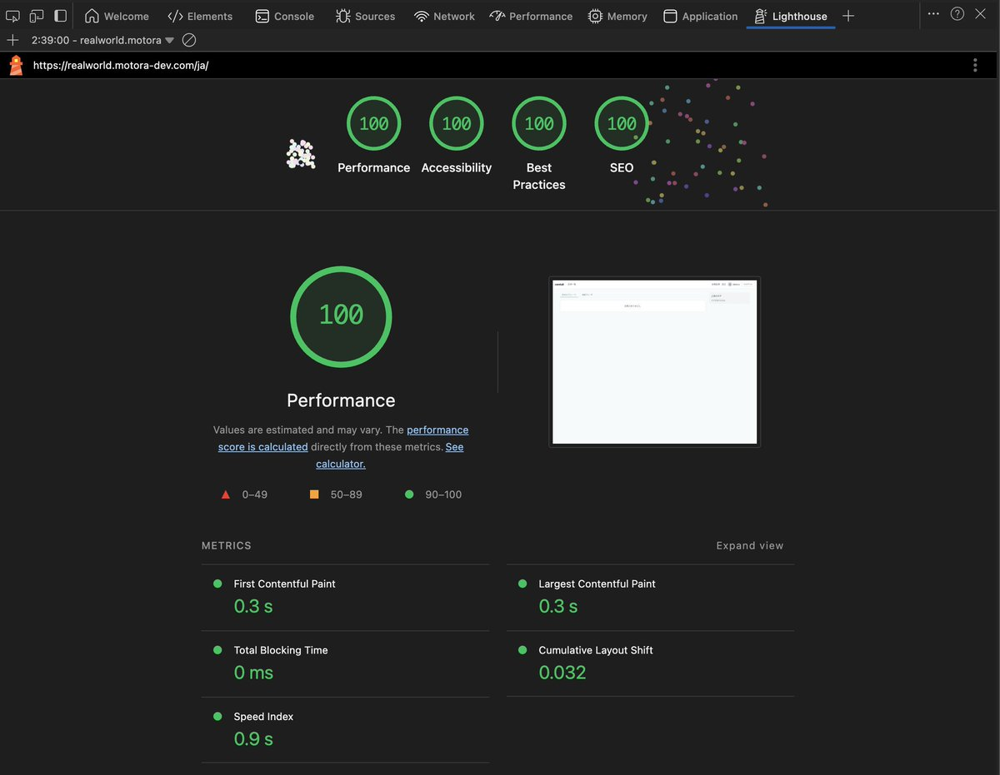
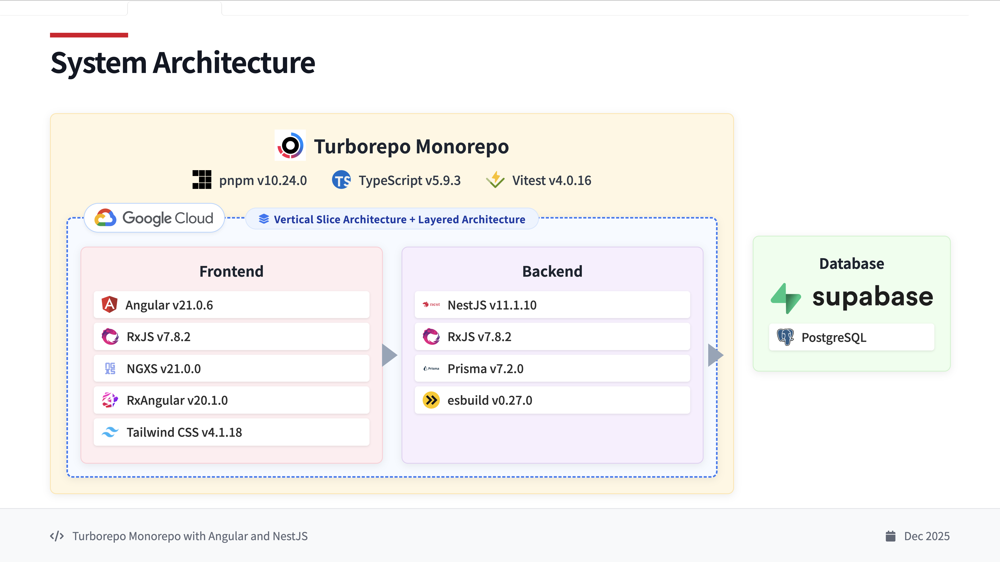
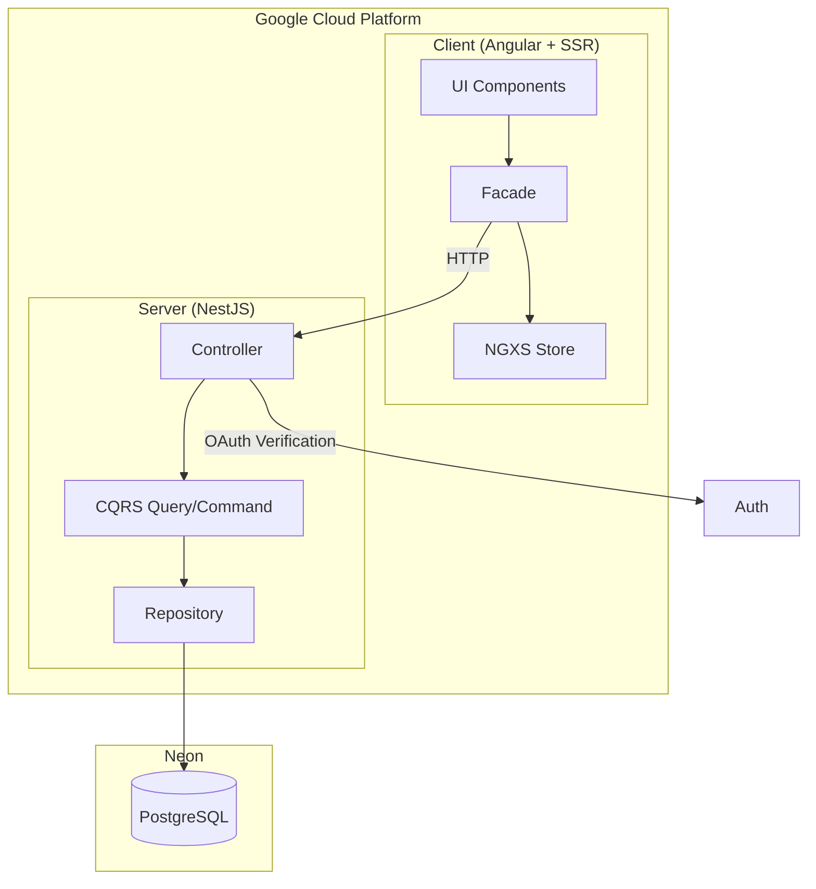

# 

> [RealWorld](https://github.com/gothinkster/realworld) (Conduit) application implemented with Angular + NestJS monorepo structure.
> Includes practical features such as CRUD operations, authentication, routing, pagination, and more.

### [Demo](https://realworld.motora-dev.com) | [RealWorld](https://github.com/gothinkster/realworld)

[](https://realworld.show)
[](https://realworld.show)
[](https://opensource.org/licenses/MIT)
[](https://nodejs.org/)
[](https://pnpm.io/)
[](https://github.com/motora-dev/angular-nestjs-realworld-example-app/actions/workflows/ci-check.yml)
[](https://github.com/motora-dev/angular-nestjs-realworld-example-app/actions/workflows/ci-test.yml)
[](https://github.com/motora-dev/angular-nestjs-realworld-example-app/actions/workflows/cd-gcp.yml)
[](https://codecov.io/github/motora-dev/angular-nestjs-realworld-example-app)

## Performance



Achieved perfect scores (100) across all categories (Performance, Accessibility, Best Practices, SEO) in Google Lighthouse performance evaluation.

This codebase was created to demonstrate a production-ready fullstack application built with **Angular** and **NestJS**, including CRUD operations, authentication, routing, pagination, and more.

For information on how to integrate with other frontends/backends, check out the [RealWorld](https://github.com/gothinkster/realworld) repository.

---

## Table of Contents

### Overview

- [Target Audience](#target-audience)
- [Project Structure](#-project-structure)
- [Architecture](#-architecture)
- [Technology Stack](#-technology-stack)

### Development

- [Development Environment Setup](#-development-environment-setup)
- [Available Commands](#-available-commands)
- [Testing](#-testing)
- [Development Flow](#-development-flow)

### Operations

- [CI/CD Pipeline](#-cicd-pipeline)
- [Environment Configuration](#-environment-configuration)
- [Infrastructure (Terraform)](#%EF%B8%8F-infrastructure-terraform)
- [Logging & Monitoring](#-logging--monitoring)

### Reference

- [Main Dependencies](#-main-dependencies)
- [API Specification](#-api-specification)

---

## Target Audience

This repository is an **enterprise-grade implementation composed entirely of TypeScript**.

- **Intermediate to advanced** users with basic Angular / NestJS knowledge
- Those who want to learn production-level architecture (CQRS, SSR/ISR, monorepo)
- Those looking for a TypeScript fullstack reference

If you want to start with a simpler implementation, we recommend:

- Frontend: [angular-realworld-example-app](https://github.com/gothinkster/angular-realworld-example-app)
- Backend: [nestjs-realworld-example-app](https://github.com/gothinkster/nestjs-realworld-example-app)

## How it works

This implementation is a "Conduit" blog platform that conforms to the [RealWorld API specification](https://github.com/gothinkster/realworld/tree/main/api).

**Main Features:**

- User authentication (registration, login, JWT)
- Article CRUD operations
- Comment functionality
- Favorite functionality
- User follow functionality
- Article filtering by tags
- Pagination

**Page Structure:**

- Home Page (URL: `/`)
  - Tag list
  - Feed / Global / Tag-filtered article list
  - Pagination
- Login / Register Page (URL: `/auth-login`, `/auth-register`)
  - OAuth authentication (Google)
- Settings Page (URL: `/settings`)
- Editor Page (URL: `/editor`, `/editor/:slug`)
  - Article creation and editing
- Article Detail Page (URL: `/article/:slug`)
  - Article delete button (shown only to author)
  - Markdown rendering
  - Comment section
  - Comment delete button (shown only to author)
- Profile Page (URL: `/profile/:username`, `/profile/:username/favorites`)
  - User information
  - Posted articles list / Favorited articles list

**Technical Features:**

- **Turborepo** monorepo structure for unified frontend/backend management
- **Angular SSR + ISR** for fast initial display and SEO optimization
- **NestJS + CQRS** for scalable backend design
- **Prisma ORM** for type-safe database access
- **OAuth authentication (Google) + JWT** for secure session management
- **CSRF protection (Double Submit Cookie)** to prevent cross-site request forgery
- **SEO optimization** (dynamic OG image generation, automatic sitemap generation)
- **Google Consent Mode v2** compliant Cookie Consent
- **Error code sync tests** to ensure translation consistency between server/client

**Differences from RealWorld Specification:**

- **Authentication method**: Implements only OAuth authentication instead of standard username/password authentication
- **Some API endpoints**: Some endpoint paths differ from the standard to conform to directory structure (Vertical Slice Architecture)

---

## 🏗 Project Structure

### Package Structure

```
angular-nestjs-realworld-example-app/
├── apps/                   # Applications
│   ├── client/             # Angular frontend application
│   └── server/             # NestJS backend API
├── packages/               # Shared packages
│   ├── database/           # Prisma schema & client
│   ├── error-code/         # Error code definitions
│   ├── eslint-config/      # ESLint configuration
│   └── typescript-config/  # TypeScript configuration
├── terraform/              # GCP infrastructure (IaC)
├── pnpm-workspace.yaml
├── turbo.json
└── package.json
```

### Application Details

#### 📱 Client (`apps/client`)

- **Framework**: [Angular](https://angular.dev/) 21.0.6 + SSR + ISR
- **Styling**: [Tailwind CSS](https://tailwindcss.com/) 4.1.18 + CVA + tailwind-merge
- **State Management**: [NGXS](https://www.ngxs.io/) 21.0.0 + @ngxs/form-plugin
- **Reactive**: [RxAngular](https://www.rx-angular.io/) 20.1.0 + RxJS 7.8.2
- **Testing**: Vitest 4.0.16 + @testing-library/angular + Storybook 10.1.10
- **Linting**: ESLint 9.39.2 (Flat Config)

#### 🚀 Server (`apps/server`)

- **Framework**: [NestJS](https://nestjs.com/) 11.1.10
- **Platform**: Express
- **ORM**: [Prisma](https://www.prisma.io/) 7.2.0
- **Testing**: Vitest 4.0.16 + Supertest
- **Linting**: ESLint 9.39.2 (Flat Config)

#### 📦 Shared Packages

- **@monorepo/database**: Prisma schema definition & client generation (User, Article, Comment, Tag models)
- **@monorepo/error-code**: Error code definitions (centralized management of domain, entity, status code, messages)
- **@monorepo/eslint-config**: Common ESLint configuration (TypeScript support)
- **@monorepo/typescript-config**: Base TypeScript configuration

## 🏛 Architecture

### System Architecture Diagram





### Design Principles

This project adopts a combination of **Vertical Slice Architecture** and **Layered Architecture**.

#### Vertical Slice Architecture

Each feature (use case) is sliced vertically and implemented as an independent module. This increases cohesion per feature and limits the scope of change impact.

#### Layered Architecture

Separated into Presentation layer, Application layer, Domain layer, and Infrastructure layer, clarifying each layer's responsibilities. By allowing dependencies only from upper to lower layers, maintainability and ease of change are ensured.

### Domain Unification Between Client / Server

By **using the same domain names in client and server**, we achieve the following benefits:

| Domain         | Purpose                          | Auth Required |
| -------------- | -------------------------------- | ------------- |
| `article-list` | Get article list and feed        | No            |
| `article`      | Get and display article details  | No            |
| `article-edit` | Create, edit, delete articles    | Yes           |
| `profile`      | User profile                     | No            |
| `user`         | User authentication and settings | Yes           |

**Benefits:**

- **Reduced cognitive load**: Using the same names in frontend and backend makes it obvious which API corresponds to which screen
- **Clear domain boundaries**: Each feature becomes an independent module with clear responsibilities

**Drawbacks:**

- **Code duplication**: To emphasize DDD and clarify domain boundaries, similar code (DTOs, models, repositories, etc.) may exist across multiple domains. For example, even when `article` (viewing) and `article-edit` (editing) need similar article retrieval logic, they are implemented separately due to different authentication requirements

### Detailed Documentation

For detailed design and architecture of each application, refer to their respective READMEs:

- [Client README](apps/client/README.md) - Facade pattern, NGXS state management, UI architecture
- [Server README](apps/server/README.md) - CQRS pattern, Repository pattern, authentication & authorization
- [Terraform README](terraform/README.md) - GCP infrastructure (IAM, Workload Identity Federation)

## 🛠 Technology Stack

- **Package Manager**: [pnpm](https://pnpm.io/) 10.24.0 (using workspace feature)
- **Build System**: [Turborepo](https://turbo.build/repo) 2.7.2
- **Language**: [TypeScript](https://www.typescriptlang.org/) 5.9.3
- **Code Quality**: ESLint 9.39.2 + Prettier 3.7.4
- **Testing**: Vitest 4.0.16 + Testing Library
- **Module System**: ES Modules (`"type": "module"`)

## 🚀 Development Environment Setup

### Required Environment

- Node.js 24.11.1 (recommended)
- pnpm 10.24.0

### Volta Setup (Recommended)

This project uses [Volta](https://volta.sh/) to automatically manage Node.js and pnpm versions.

```bash
# If Volta is not installed
# macOS / Linux
curl https://get.volta.sh | bash

# Windows
# Refer to https://docs.volta.sh/guide/getting-started
```

#### Enabling pnpm Support

Volta's pnpm support is currently an experimental feature. To enable it, you need to set the environment variable `VOLTA_FEATURE_PNPM`.

**For macOS / Linux:**

Add the following to your shell profile file (`.zshrc`, `.bash_profile`, etc.):

```bash
export VOLTA_FEATURE_PNPM=1
```

Apply the configuration:

```bash
# For zsh
source ~/.zshrc

# For bash
source ~/.bash_profile
```

**For Windows:**

Set `VOLTA_FEATURE_PNPM` to `1` as a system environment variable (System Settings > Environment Variables).

```bash
# When you navigate to the project directory, Volta automatically
# switches to Node.js 24.11.1 and pnpm 10.24.0 based on package.json settings
```

> **Note**: Volta's pnpm support is an experimental feature. For details, refer to the [official documentation](https://docs.volta.sh/advanced/pnpm).

Using Volta ensures the appropriate versions are automatically set per project, preventing version inconsistencies.

### Installation

```bash
# Install dependencies
pnpm install
```

### Starting Development Server

```bash
# Start all applications
pnpm start

# Start individually
pnpm start --filter=@monorepo/client    # Angular (http://localhost:4200)
pnpm start --filter=@monorepo/server    # NestJS (http://localhost:4000)

# Start Storybook (Client only)
pnpm storybook --filter=@monorepo/client    # Storybook (http://localhost:6006)
```

> **Note**: Using the `pnpm xxx --filter=yyy` format applies Turborepo's dependency graph, automatically building dependent packages. The `pnpm --filter=yyy xxx` format ignores dependencies.

## 📝 Available Commands

### Global Commands (Run from root directory)

```bash
# Complete cleanup (remove node_modules + pnpm store prune)
pnpm clean

# Clear cache (keep node_modules)
pnpm clean:cache

# Start dev server (all packages)
pnpm start

# Start production mode (all packages)
pnpm start:prd

# Build (all packages)
pnpm build

# TypeScript type check (all packages)
pnpm tsc

# Run tests (all packages)
pnpm test

# Tests with coverage (all packages)
pnpm test:coverage

# Run linting (all packages)
pnpm lint

# Auto-fix linting (all packages)
pnpm lint:fix

# Format check (all packages)
pnpm format

# Auto-fix formatting (all packages)
pnpm format:fix

# Run all checks (type check, format, lint, build, test)
pnpm check-all
```

### Client-Specific Commands

```bash
# TypeScript type check (for build)
pnpm tsc:build --filter=@monorepo/client

# TypeScript type check (for test code)
pnpm tsc:test --filter=@monorepo/client

# Start Storybook
pnpm storybook --filter=@monorepo/client

# Build Storybook
pnpm build-storybook --filter=@monorepo/client
```

### lint-staged Configuration

The following are automatically executed on commit:

- TypeScript type checking (separate configurations for source and tests)
- Code formatting with Prettier
- Linting with ESLint

## 🧪 Testing

### Running Tests

```bash
# Run all tests
pnpm test

# Run with coverage
pnpm test:coverage

# Test specific package
pnpm test --filter=@monorepo/client
pnpm test --filter=@monorepo/server
```

### Test Environment Features

- **Client**:
  - Vitest + @testing-library/angular (component tests)
  - Storybook (UI catalog & documentation)
- **Server**: E2E test support (using Supertest)
- **Common**: Strict type checking with `tsconfig.spec.json`

## 📦 Main Dependencies

### Common


### Client


### Server


## 📖 API Specification

This application conforms to the API specification defined by the [RealWorld](https://github.com/gothinkster/realworld) project. This allows it to be combined with other RealWorld implementations (frontend/backend).

> [API Specification Details](https://github.com/gothinkster/realworld/tree/main/api)

Project details: https://github.com/gothinkster/realworld

**Note:** Due to OAuth-only authentication implementation and adoption of Vertical Slice Architecture, some API endpoints differ from the standard specification.

## 🔄 CI/CD Pipeline

Automated pipelines built with GitHub Actions.

### CI (Continuous Integration)

| Workflow                   | Trigger                | Contents                               |
| -------------------------- | ---------------------- | -------------------------------------- |
| **Check** (`ci-check.yml`) | PR/Push (develop/main) | Format, Lint, Build, Type check        |
| **Test** (`ci-test.yml`)   | PR/Push (develop/main) | Tests with change detection + Coverage |

#### Test Workflow Details

`ci-test.yml` consists of 5 jobs:

| Job                      | Target        | Contents                           |
| ------------------------ | ------------- | ---------------------------------- |
| `test-coverage-packages` | `packages/`   | Unit tests + Coverage              |
| `test-coverage-client`   | `apps/client` | Unit tests + Coverage              |
| `test-e2e-client`        | `apps/client` | E2E tests (translation sync, etc.) |
| `test-coverage-server`   | `apps/server` | Unit tests + Coverage              |
| `test-e2e-server`        | `apps/server` | E2E tests                          |

Each job includes change detection via `tj-actions/changed-files` and only runs when the relevant package has changes.

### CD (Continuous Delivery)

| Workflow                         | Trigger             | Contents                           |
| -------------------------------- | ------------------- | ---------------------------------- |
| **Deploy to GCP** (`cd-gcp.yml`) | Push (develop/main) | Cloud Build + Cloud Run deployment |
| **Preview** (`cd-preview.yml`)   | PR (develop)        | Preview environment deployment     |
| **Database** (`cd-database.yml`) | Manual              | Database migrations                |

### Features

- **Change Detection**: Only tests/deploys packages with changes using `tj-actions/changed-files`
- **Workload Identity Federation**: Secure authentication without service account keys
- **Environment Separation**: Deploy to different environments based on develop/main branches

## 🌍 Environment Configuration

| Environment | Branch         | Purpose                                        |
| ----------- | -------------- | ---------------------------------------------- |
| **develop** | `develop`      | Development environment (feature verification) |
| **preview** | PR → `develop` | PR preview environment                         |
| **main**    | `main`         | Production environment                         |

### Environment Variables

Configuration for each environment is managed at:

- **Client**: `apps/client/environments/environment.{env}.ts`
- **Server**: GitHub Secrets + Secret Manager
- **Terraform**: `terraform/environments/{env}/terraform.tfvars`

## 🏗️ Infrastructure (Terraform)

GCP resources are managed with Terraform.

### Module Structure

| Module        | Purpose                                                 |
| ------------- | ------------------------------------------------------- |
| **iam**       | Service accounts (for GitHub Actions, Cloud Run)        |
| **wif**       | Workload Identity Federation (keyless authentication)   |
| **secrets**   | Secret Manager (secure environment variable management) |
| **cloud-run** | Cloud Run service definition (optional)                 |

### Enabled APIs

- Cloud Run API
- Cloud Build API
- Secret Manager API
- IAM API
- Workload Identity API

For details, refer to [Terraform README](terraform/README.md).

## 📊 Logging & Monitoring

### Cloud Logging

Cloud Run logs are automatically sent to Cloud Logging.

```bash
# View logs (gcloud CLI)
gcloud logging read "resource.type=cloud_run_revision" --limit=50
```

### Check Points

| Item                  | How to Check                          |
| --------------------- | ------------------------------------- |
| **Application logs**  | Cloud Console > Cloud Run > Logs      |
| **Build logs**        | Cloud Console > Cloud Build > History |
| **Deployment status** | GitHub Actions > Workflow run history |
| **Test coverage**     | Codecov dashboard                     |

## 🏃 Development Flow

1. Create feature branch from `develop`

   ```bash
   git checkout develop
   git pull origin develop
   git checkout -b feature/your-feature-name
   ```

2. Implement changes

3. Auto-fix code formatting and linting

   ```bash
   pnpm format:fix
   pnpm lint:fix
   ```

4. Write and run tests

   ```bash
   pnpm test
   ```

5. Run `pnpm check-all` for all checks (type check, format, lint, build, test)

   ```bash
   pnpm check-all
   ```

6. Commit (lint-staged runs automatically)

   ```bash
   git add .
   git commit -m "feat: your feature description"
   ```

7. Create pull request
   - Create PR against `develop` branch
   - After PR creation, automatically deploys to preview environment

### Branch Naming Convention

| Prefix      | Purpose       | Example              |
| ----------- | ------------- | -------------------- |
| `feature/`  | New feature   | `feature/add-login`  |
| `fix/`      | Bug fix       | `fix/header-layout`  |
| `refactor/` | Refactoring   | `refactor/auth-flow` |
| `docs/`     | Documentation | `docs/update-readme` |

<br />

[](https://thinkster.io)
