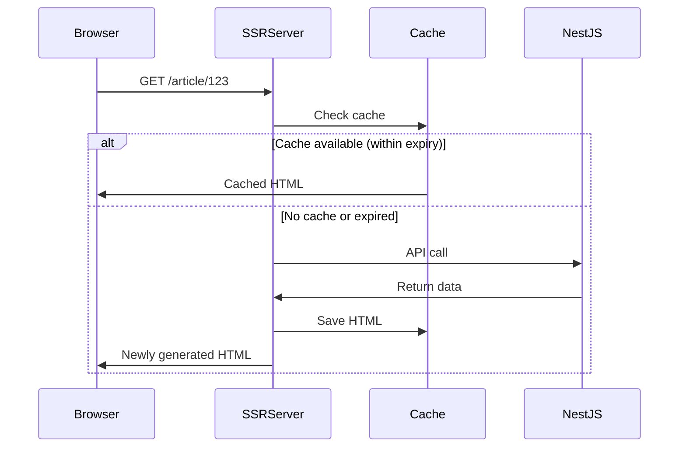

# Client Application

Frontend application built with Angular 21 + Tailwind CSS 4 + SSR.

**Framework & Build:**</br>
[](https://angular.dev/)
[](https://material.angular.io/cdk/categories)
[](https://www.typescriptlang.org/)
[](https://angular.dev/tools/cli/build-system-migration)

**Lint & Format:**</br>
[](https://eslint.org/)
[](https://prettier.io/)

**SSR:**</br>
[](https://angular.dev/guide/ssr)
[](https://www.rx-angular.io/docs/isr)
[](https://expressjs.com/)

**State Management & Reactive:**</br>
[](https://www.ngxs.io/)
[](https://rxjs.dev/)
[](https://www.rx-angular.io/)

**Styling:**</br>
[](https://tailwindcss.com/)
[](https://postcss.org/)
[](https://cva.style/)
[](https://github.com/lukeed/clsx)
[](https://github.com/dcastil/tailwind-merge)

**Testing & UI Catalog:**</br>
[](https://vite.dev/)
[](https://vitest.dev/)
[](https://testing-library.com/)
[](https://github.com/jsdom/jsdom)
[](https://storybook.js.org/)

## Table of Contents

**Getting Started**

- [Development Commands](#development-commands)
- [Environment Variables](#environment-variables)

**Architecture**

- [Design Philosophy](#design-philosophy)
- [Architecture](#architecture)
- [Directory Structure](#directory-structure)
- [Placement Guidelines](#placement-guidelines)

**Patterns**

- [State Management (NGXS)](#state-management-ngxs)
- [Reactive Pattern Usage](#reactive-pattern-usage)
- [Form Management](#form-management)
- [Internationalization (i18n)](#internationalization-i18n)
- [UI Architecture](#ui-architecture)
- [Error Handling](#error-handling)
- [Spinner](#spinner)
- [Snackbar](#snackbar)

**SSR / SEO**

- [ISR (Incremental Static Regeneration)](#isr-incremental-static-regeneration)
- [SEO Support](#seo-support)
- [Cookie Consent (Google Consent Mode v2)](#cookie-consent-google-consent-mode-v2)

**Development**

- [Testing Strategy](#testing-strategy)
- [Storybook](#storybook)
- [Performance Optimization](#performance-optimization)
- [Error Code Sync Test](#error-code-sync-test)
- [Package Management (pnpm catalog)](#package-management-pnpm-catalog)

---

## Development Commands

**Keywords**: `pnpm`, `dev server`, `build`, `test`, `lint`, `Storybook`

This section explains the main development commands used in the project.

```bash
# Complete cleanup (including node_modules)
pnpm clean

# Clear cache (.angular, .turbo, coverage, dist)
pnpm clean:cache

# Start dev server
pnpm start

# Build
pnpm build

# Start SSR server
pnpm serve:ssr:client

# Test
pnpm test

# Lint
pnpm lint

# Start Storybook
pnpm storybook

# Build Storybook
pnpm build-storybook
```

## Environment Variables

**Keywords**: `environment variables`, `environment.ts`, `.env`, `environment configuration`, `BUILD_CONFIGURATION`

This section explains the required environment variables and their configuration methods.

### environment.ts (Build-time Configuration)

Configuration embedded during Angular application build.

| Variable        | Description          | Example                 | Required |
| --------------- | -------------------- | ----------------------- | -------- |
| **Application** |                      |                         |          |
| `production`    | Production mode flag | `false`                 | Yes      |
| **API / URL**   |                      |                         |          |
| `apiUrl`        | Backend API URL      | `http://localhost:4000` | Yes      |
| `baseUrl`       | Frontend base URL    | `http://localhost:4200` | Yes      |
| **Analytics**   |                      |                         |          |
| `gaId`          | Google Analytics ID  | `G-XXXXXXX`             | No       |

#### Environment File Types

| File                     | Purpose                 | BUILD_CONFIGURATION |
| ------------------------ | ----------------------- | ------------------- |
| `environment.ts`         | Development (default)   | -                   |
| `environment.develop.ts` | Development environment | `develop`           |
| `environment.preview.ts` | Preview environment     | `preview`           |
| `environment.prod.ts`    | Production environment  | `production`        |

#### Configuration Example

```typescript
// File: apps/client/environments/environment.ts
export const environment = {
  production: false,
  apiUrl: 'http://localhost:4000',
  baseUrl: 'http://localhost:4200',
  gaId: '',
};
```

### .env (SSR Server Runtime Configuration)

Runtime environment variables used by the SSR server (Express).

| Variable              | Description                          | Example           | Required |
| --------------------- | ------------------------------------ | ----------------- | -------- |
| **Server**            |                                      |                   |          |
| `NODE_ENV`            | Environment (production/development) | `production`      | No       |
| `PORT`                | Server port number                   | `8080`            | No       |
| **Basic Auth**        |                                      |                   |          |
| `BASIC_AUTH_ENABLED`  | Enable Basic authentication          | `true`            | No       |
| `BASIC_AUTH_USER`     | Basic auth username                  | `admin`           | No       |
| `BASIC_AUTH_PASSWORD` | Basic auth password                  | `password`        | No       |
| **ISR**               |                                      |                   |          |
| `ISR_SECRET`          | ISR invalidate secret                | `MY_SECRET_TOKEN` | No       |

#### Setting Environment Variables

```bash
# Copy .env.example
cp .env.example .env

# Edit .env in your editor and set actual values
```

### BUILD_CONFIGURATION (Docker Build Configuration)

Environment variable used during Docker build. Specifies which environment file to use.

| Variable              | Description                       | Example      | Required |
| --------------------- | --------------------------------- | ------------ | -------- |
| `BUILD_CONFIGURATION` | Build configuration (environment) | `production` | No       |

#### Usage

```bash
# Local build (default: develop)
pnpm build

# Production environment build
BUILD_CONFIGURATION=production pnpm build

# During Docker build
docker build --build-arg BUILD_CONFIGURATION=production -t client .
```

#### Cloud Build Configuration

Specify as `_BUILD_CONFIGURATION` variable in `cloudbuild.yaml`:

```yaml
substitutions:
  _BUILD_CONFIGURATION: production
```

---

## Design Philosophy

**Keywords**: `design principles`, `Vertical Slice Architecture`, `DDD`, `Facade pattern`, `shadcn/ui`

This section explains the project's design philosophy and why this structure was chosen. Also refer to the [Architecture](#architecture) section for details.

### Why This Structure?

1. **Alphabetical Consistency**: Visually organized in order: `app → components → domains → modules → shared`
2. **Vertical Slice**: Each page is self-contained as an independent slice with high cohesion
3. **DDD Boundary Awareness**: Page-specific items stay within pages; only shared items move to upper layers
4. **shadcn/ui Approach**: Place UI primitives in `shared/ui/` for copy & customizable structure
5. **Facade Pattern**: Abstracts Store access, reducing coupling with components

### Differences from Angular Official Style Guide

This structure differs from the Angular official style guide's recommended feature-based directory structure. This is an intentional choice prioritizing design principles (Vertical Slice / Layered Architecture).

Team members should refer to this README and understand the placement guidelines before development.

## Architecture

**Keywords**: `Vertical Slice Architecture`, `Layered Architecture`, `layer structure`, `dependencies`

This section explains the overall architecture design. We adopt a combination of Vertical Slice Architecture and Layered Architecture.

For details, also refer to the [Design Philosophy](#design-philosophy) section.

### Layer Structure

| Directory     | Layer                 | Responsibility                                    | Status |
| ------------- | --------------------- | ------------------------------------------------- | ------ |
| `app/`        | Presentation          | Pages, routing, UI display                        | In use |
| `components/` | Presentation (Shared) | UI components shared across pages                 | In use |
| `domains/`    | Domain + Application  | Entities, state management (NGXS), business logic | In use |
| `modules/`    | Application           | Logic shared across app/components/domains        | In use |
| `shared/`     | Infrastructure        | Utilities, UI primitives, adapters                | In use |

### Dependency Rules

```
app/ ──→ components/ ──→ domains/ ──→ modules/ ──→ shared/
```

- Upper layers can depend on lower layers (rightward dependencies only)
- Lower layers must not depend on upper layers (leftward dependencies prohibited)
- `shared/` can be referenced from all layers

## Directory Structure

**Keywords**: `Vertical Slice`, `directory structure`, `app/`, `components/`, `domains/`, `modules/`, `shared/`

This section explains the project's directory structure and each directory's role.

```
src/
├── app/              # (a) Root component + pages
│   ├── app.ts            # Root component
│   ├── app.config.ts     # Application config
│   ├── app.routes.ts     # Routing definition
│   └── {page}/           # Each page (Vertical Slice)
│       ├── {page}.ts         # Parent component (Facade, RxLet)
│       ├── {page}.html       # Layout + sub-component calls
│       ├── {page}.routes.ts  # Routing definition
│       └── components/       # Page-specific sub-components
│           └── {name}/
├── components/       # (c) Components shared across pages (Composed UI)
├── domains/          # (d) Domain logic + state management (NGXS)
├── modules/          # (m) Logic shared across app/components/domains
├── shared/           # (s) Shared resources
│   ├── lib/              # Utility functions
│   └── ui/               # UI primitives (shadcn/ui equivalent)
├── main.ts               # Client entry point
├── main.server.ts        # SSR entry point
├── server.ts             # Express server (SSR + ISR)
└── index.html
```

### Standard Page Component Pattern

Each page follows the standard pattern: **Parent component + Sub-components**.

```
app/{page}/
├── {page}.ts              # Parent (Facade provision, RxLet, Input/Output coordination)
├── {page}.html            # Layout + sub-component calls
├── {page}.routes.ts       # Routing definition
├── index.ts
└── components/            # Page-specific sub-components
    ├── index.ts
    └── {name}/
        ├── {name}.ts
        ├── {name}.html
        └── index.ts
```

**Responsibility Separation:**

- **Parent Component**: Facade provision, Observable subscription (`*rxLet`), Input/Output coordination with sub-components
- **Sub-components**: Display only using data received via Input (Presentational)

**Example:**

```typescript
// File: apps/client/src/app/article-list/article-list.ts
// Parent component implementation example
@Component({
  imports: [RxLet, ArticleListContentComponent],
  providers: [ArticleListFacade],
})
export class ArticleListComponent {
  private readonly facade = inject(ArticleListFacade);
  readonly articleList$ = this.facade.articleList$;
}
```

```html
<!-- File: apps/client/src/app/article-list/article-list.html -->
<!-- Parent template implementation example -->
<ng-container *rxLet="articleList$; let articles">
  <app-article-list-content [articles]="articles" />
</ng-container>
```

```typescript
// File: apps/client/src/app/article-list/components/article-list-content/article-list-content.ts
// Sub-component implementation example
@Component({ ... })
export class ArticleListContentComponent {
  readonly articles = input.required<Article[]>();
}
```

### Lifecycle Hooks

In modern Angular (`inject()` + Signal), don't use `ngOnInit`; initialize in the **constructor**.

```typescript
// Recommended: Initialize in constructor
@Component({ ... })
export class ArticleListComponent {
  private readonly facade = inject(ArticleListFacade);
  readonly articleList$ = this.facade.articleList$;

  constructor() {
    this.facade.loadArticleList();
  }
}

// ❌ Don't use ngOnInit
export class ArticleListComponent implements OnInit {
  ngOnInit(): void {
    this.facade.loadArticleList();
  }
}
```

**Reasons:**

- `inject()` works in constructor injection context
- Signal inputs (`input()`) are available at constructor time
- `ActivatedRoute.snapshot` can also be retrieved in constructor
- Code becomes simpler

## Placement Guidelines

**Keywords**: `file placement`, `placement rules`, `path aliases`, `naming conventions`

This section explains guidelines for where to place files and components. Also refer to the [Directory Structure](#directory-structure) section for details.

### What Goes Where

| Item                         | Location                  | Example                                    |
| ---------------------------- | ------------------------- | ------------------------------------------ |
| Routing target pages         | `app/{page}/`             | `app/home/home.ts`                         |
| Page-specific UI parts       | `app/{page}/components/`  | `app/home/components/tag-list/tag-list.ts` |
| UI shared across pages       | `components/`             | `components/fields/input-field/`           |
| Composed UI (logic binding)  | `components/`             | `components/fields/input-field/`           |
| State management (NGXS)      | `domains/{domain}/store/` | `domains/home/store/home.state.ts`         |
| Facade                       | `domains/{domain}/`       | `domains/home/home.facade.ts`              |
| Business logic               | `domains/{domain}/`       | `domains/user/user.service.ts`             |
| Shared across app/comp/dom   | `modules/`                | `modules/ui/ui.facade.ts`                  |
| UI primitives (minimal unit) | `shared/ui/`              | `shared/ui/button/button.ts`               |
| Utility functions            | `shared/lib/`             | `shared/lib/utils.ts`                      |

### Path Aliases

```typescript
import { ButtonDirective } from '$shared/ui';
import { cn } from '$shared/lib';
import { HomeFacade } from '$domains/home';
import { InputFieldComponent } from '$components/fields';
```

| Alias           | Path               |
| --------------- | ------------------ |
| `$app/*`        | `src/app/*`        |
| `$components/*` | `src/components/*` |
| `$domains/*`    | `src/domains/*`    |
| `$modules/*`    | `src/modules/*`    |
| `$shared/*`     | `src/shared/*`     |

### Naming Conventions

- Component: `{name}.ts` (single-file component)
- Template: `{name}.html` (separate only when necessary)
- Style: `{name}.css` (separate only when necessary)
- Test: `{name}.spec.ts` or `{name}.test.ts`

---

## State Management (NGXS)

**Keywords**: `NGXS`, `state management`, `Facade`, `Store`, `Action`, `Selector`

This section explains state management patterns using NGXS. Focuses on responsibility separation through the Facade pattern and Store state update methods.

**Related Files**:

- `apps/client/src/domains/{domain}/{domain}.facade.ts` - Facade implementation
- `apps/client/src/domains/{domain}/store/{domain}.state.ts` - State definition
- `apps/client/src/domains/{domain}/store/{domain}.actions.ts` - Action definition

### Domain Structure

```
domains/{domain}/
├── api/
│   ├── {domain}.api.ts          # API calls (internal)
│   ├── {domain}.response.ts     # API response types (internal)
│   └── index.ts
├── model/
│   ├── {domain}.model.ts        # State/UI models (public)
│   └── index.ts
├── store/
│   ├── {domain}.state.ts        # State definition + Selector (internal)
│   ├── {domain}.actions.ts      # Action definition (internal)
│   └── index.ts
├── {domain}.facade.ts           # API calls + Store operations (public)
└── index.ts                     # Export only model and facade
```

### Design Principles

#### 1. Naming Alignment between app/ and domains/

Page directories in `app/` and domain directories in `domains/` use **the same name**.

```
app/
  article-list/     ← Article list page
  article-page/     ← Article detail page

domains/
  article-list/     ← Article list domain
  article-page/     ← Article detail domain
```

File names and type names within domains are also unified.

```
domains/article-page/
  api/article-page.api.ts           # ArticlePageApi
  api/article-page.response.ts      # ArticlePageResponse
  model/article-page.model.ts       # ArticlePage, ArticlePageItem
  store/article-page.actions.ts     # SetArticlePage, SetArticlePageItems
  store/article-page.state.ts       # ArticlePageState
  article-page.facade.ts            # ArticlePageFacade
```

**Benefits:**

- Clear which page uses which domain
- Searching for `ArticlePage` hits all related files
- New members won't get lost

#### 2. Limited Public Scope

`index.ts` exports **only model and facade**, hiding `api` and `store` as internal implementation.

```typescript
// domains/article-list/index.ts
export * from './model'; // ✅ Public
export * from './article-list.facade'; // ✅ Public
// Don't export api/ and store/
```

**Benefits:**

- Clear what should be used externally
- Internal implementation changes don't affect external code
- Reduces cognitive load

#### 3. Separation of API Models and State Models

Define API response types and State types separately.

```typescript
// api/article-list.response.ts (internal, hidden)
export interface ArticleResponse {
  id: string;
  createdAt: string; // API returns string
}

// model/article-list.model.ts (public)
export interface Article {
  id: string;
  createdAt: Date; // App uses Date
}
```

**Benefits:**

- API format changes don't affect State/UI layers
- Conversion logic centralized in Facade

#### 4. Responsibility Separation via Facade Pattern

Instead of the common "call API within State" pattern, **bind API calls and Store operations within Facade**.

```typescript
// Not recommended: Call API within State (tight coupling)
@Action(LoadArticleList)
loadArticleList(ctx) {
  return this.api.getArticleList().pipe(
    tap((res) => ctx.dispatch(new LoadArticleListSuccess(res))),
    catchError((err) => ctx.dispatch(new LoadArticleListFailure(err))),
  );
}

// Recommended: API calls + Store operations in Facade
loadArticleList(): void {
  this.api.getArticleList().subscribe((response) => {
    const articles: Article[] = response.articleList.map((r) => ({
      id: r.id,
      title: r.title,
      createdAt: new Date(r.createdAt),
    }));
    this.store.dispatch(new SetArticleList(articles));
  });
}
```

**Benefits:**

- State is purely for data holding (get/set)
- Decouples API and Store
- Action names are symmetrical and clear (`getArticleList` / `setArticleList`)

#### 5. Common Error Handling

`loading` / `error` states aren't implemented in each domain; handled by common processing.

- **Interceptor**: Catches HTTP errors and forwards to notification domain
- **Notification domain**: UI feedback like toast display

```typescript
// Not recommended: Don't manage loading/error in each domain
interface ArticleListStateModel {
  articleList: Article[];
  loading: boolean; // Unnecessary
  error: string; // Unnecessary
}

// ✅ Hold only data
interface ArticleListStateModel {
  articleList: Article[];
}
```

### Facade Usage Example

```typescript
// Facade usage example (from component)
private readonly facade = inject(ArticleListFacade);
readonly articleList$ = this.facade.articleList$;

constructor() {
  this.facade.loadArticleList();
}
```

### Form Integration (@ngxs/form-plugin)

Automatically syncs Reactive Forms with NGXS Store. For details, also refer to the [Form Management](#form-management) section.

```html
<form [formGroup]="form" ngxsForm="domain.formPath">
  <input formControlName="text" />
</form>
```

Defining `textForm` in State automatically syncs form values to Store.

### State Update Pattern

For NGXS Store state updates, use the following patterns:

- **Methods to use**: `ctx.setState()` and `patch` operator (`@ngxs/store/operators`)
- **Methods not to use**: Don't use `ctx.patchState()`

Implementation example:

```typescript
// File: apps/client/src/domains/article-edit/store/article-edit.state.ts
// State update pattern implementation example
@Action(SetArticle)
setArticle(ctx: StateContext<ArticleEditStateModel>, action: SetArticle) {
  ctx.setState(
    patch({
      articleForm: patch({
        model: patch({
          ...action.article,
        }),
      }),
    }),
  );
}
```

## Reactive Pattern Usage

**Keywords**: `Signal`, `Observable`, `NGXS`, `RxLet`, `Reactive Forms`, `@ngxs/form-plugin`

This section explains the usage of reactive patterns like Signal, Observable, NGXS, and Reactive Forms.

| Scope        | Technology                       | Purpose                          | Example                    |
| ------------ | -------------------------------- | -------------------------------- | -------------------------- |
| Local state  | **Signal**                       | Component internal               | `signal()`, `computed()`   |
| Global state | **NGXS + `*rxLet`**              | Domain binding, large-scale data | `facade.data$` + `*rxLet`  |
| Forms        | **Reactive Forms + form-plugin** | Validation + Store sync          | `ngxsForm`                 |
| Templates    | **RxLet** (Don't use AsyncPipe)  | Observable rendering             | `*rxLet="data$; let data"` |

### Usage Guidelines

- **shared/ui/, components/**: Use Signal for internal implementation
- **Domain integration**: NGXS Store + `*rxLet` to render Observables (refer to [State Management (NGXS)](#state-management-ngxs) section)
- **Forms**: Validation with Reactive Forms, Store sync with @ngxs/form-plugin (refer to [Form Management](#form-management) section)
- **Observables in templates**: Don't use `AsyncPipe`; always use `RxLet`

## Form Management

**Keywords**: `Reactive Forms`, `@ngxs/form-plugin`, `validation`, `InputFieldComponent`, `parent-child component coordination`

This section explains form management patterns integrating Reactive Forms with NGXS Store, including parent-child component coordination and top-down validation strategy.

**Related Files**:

- `apps/client/src/app/article-edit/components/edit-form/edit-form.ts` - Form component example
- `apps/client/src/components/fields/input-field/input-field.ts` - InputFieldComponent implementation

### Technology Stack

| Technology          | Role                                       |
| ------------------- | ------------------------------------------ |
| Reactive Forms      | Validation (`required`, `minLength`, etc.) |
| @ngxs/form-plugin   | Automatic Store sync                       |
| InputFieldComponent | Common error display                       |

### Using InputFieldComponent

**File**: `apps/client/src/components/fields/input-field/input-field.ts`

```html
<app-input-field label="Username" [control]="form.controls.username">
  <input appInput formControlName="username" />
</app-input-field>
```

Features:

- Label display
- Automatic validation error display
- Error state styling

### Form Management Pattern (Parent-Child Component Coordination)

Form management pattern used in article-edit:

- **Parent component**: Facade calls, get `isFormInvalid$` and `isFormDirty$` via Facade
- **Child component**: Define `FormGroup`, connect with NGXS Store via `ngxsForm` directive
- **Save action**: Defined in parent component (`onSave()` method)
- **URL parameter validation**: Store URL parameters and validate simultaneously using Forms Validators

Implementation example:

```typescript
// File: apps/client/src/app/article-edit/article-edit.ts
// Parent component implementation example
@Component({ ... })
export class ArticleEditComponent {
  private readonly facade = inject(ArticleEditFacade);
  readonly isFormInvalid$ = this.facade.isFormInvalid$;
  readonly isFormDirty$ = this.facade.isFormDirty$;

  onSave(): void {
    const form = this.editForm()?.form;
    if (!form || form.invalid) return;
    // Save processing
  }
}
```

```typescript
// File: apps/client/src/app/article-edit/components/edit-form/edit-form.ts
// Child component implementation example
@Component({ ... })
export class EditFormComponent {
  readonly form = this.fb.nonNullable.group({
    articleId: ['', [Validators.required]],
    title: ['', [Validators.required]],
    // ...
  });
}
```

```html
<!-- File: apps/client/src/app/article-edit/components/edit-form/edit-form.html -->
<!-- Child component template implementation example -->
<form [formGroup]="form" ngxsForm="articleEdit.articleForm">
  <input formControlName="title" />
</form>
```

### Validation Strategy (Top-Down Validation)

We adopt **top-down validation**:

- **Validation target**: User input (forms) only
- **Not validated**: API responses, Store data
- **Benefits**: Achieves high maintainability and extensibility with minimal necessary validation

**Implementation policy**:

- Don't use Zod directly on API responses or Store; only validate component inputs
- Use Reactive Forms `Validators` (`required`, `minLength`, etc.)

```typescript
// Recommended: Validate in forms
readonly form = this.fb.nonNullable.group({
  title: ['', [Validators.required, Validators.minLength(1)]],
});

// Not recommended: Don't validate API responses or Store data
interface ArticleResponse {
  id: string;
  title: string; // Validation unnecessary
}
```

## Internationalization (i18n)

**Keywords**: `i18n`, `internationalization`, `@angular/localize`, `$localize`, `XLIFF`, `build-time translation`

This section explains build-time i18n implementation using `@angular/localize`.

**Related Files**:

- `apps/client/public/i18n/ui/*.json` - UI translation source files
- `apps/client/public/i18n/error/*.json` - Error translation source files
- `apps/client/locale/messages.xlf` - Extracted messages (auto-generated)
- `apps/client/locale/messages.ja.xlf` - Japanese translations (auto-generated)
- `apps/client/scripts/merge-translations.ts` - JSON → XLF conversion script

### Why @angular/localize?

| Comparison         | @angular/localize              | ngx-translate                        |
| ------------------ | ------------------------------ | ------------------------------------ |
| Translation timing | Build-time (compile-time)      | Runtime                              |
| Bundle size        | Optimized per language         | Includes loaders for all languages   |
| SSR performance    | ✅ Returns pre-translated HTML | ❌ Loads translations on client      |
| Layout Shift       | ✅ None                        | ⚠️ May occur during translation load |

**We adopted `@angular/localize` for SSR performance optimization.**

### Translation Source File Structure

Translations are managed in JSON files and converted to XLIFF format at build time.

```
apps/client/
├── public/i18n/           # Translation sources (manually edited)
│   ├── error/
│   │   ├── en.json
│   │   └── ja.json
│   └── ui/
│       ├── en.json
│       └── ja.json
└── locale/                # Generated XLIFF (in .gitignore)
    ├── messages.xlf       # Generated by ng extract-i18n
    └── messages.ja.xlf    # Generated by merge-translations.ts
```

### Template Usage

#### i18n Attribute (Recommended)

```html
<!-- Static text -->
<h1 i18n="@@home.title">Welcome to Conduit</h1>

<!-- Attribute translation -->
<input placeholder="Search..." i18n-placeholder="@@search.placeholder" />

<!-- Button -->
<button i18n="@@common.save">Save</button>
```

#### $localize Tag (In TypeScript)

```typescript
// In component
const message = $localize`:@@error.unexpectedError:An unexpected error occurred`;

// In SEO service
this.seoService.setPageMeta({
  title: $localize`:@@seo.home.title:Home`,
  description: $localize`:@@seo.home.description:A place to share your Angular knowledge.`,
});
```

### i18n Workflow

#### 1. Add Translation Key

Add `i18n` attribute or `$localize` tag in template or TypeScript:

```html
<p i18n="@@article.readMore">Read more</p>
```

#### 2. Add Translation to JSON Files

```json
// public/i18n/ui/en.json
{
  "article": {
    "readMore": "Read more"
  }
}

// public/i18n/ui/ja.json
{
  "article": {
    "readMore": "続きを読む"
  }
}
```

#### 3. Auto-Conversion at Build Time

```bash
# Automatically runs on prebuild / prestart:ssr
pnpm i18n
# ↓ Internal processes
# 1. ng extract-i18n → generates locale/messages.xlf
# 2. scripts/merge-translations.ts → generates locale/messages.ja.xlf
```

### Locale Selection in SSR

Serves appropriate locale build based on `Accept-Language` header.

```typescript
// apps/client/src/server.ts
import acceptLanguage from 'accept-language';

acceptLanguage.languages(['en', 'ja']);

app.use((req, res, next) => {
  const lang = acceptLanguage.get(req.headers['accept-language']) || 'en';
  const localeBrowserDistFolder = join(browserDistFolder, lang);
  // Serve pre-built HTML for the detected language
});
```

**Result**: Pre-translated HTML is immediately returned based on user's browser language setting, preventing Layout Shift.

### angular.json Configuration

```json
{
  "i18n": {
    "sourceLocale": "en",
    "locales": {
      "ja": "locale/messages.ja.xlf"
    }
  },
  "architect": {
    "build": {
      "options": {
        "polyfills": ["@angular/localize/init"]
      },
      "configurations": {
        "production": {
          "localize": true
        }
      }
    }
  }
}
```

### Missing Translation Detection

Tests verify translation key synchronization:

```bash
pnpm test
# translation-sync.spec.ts checks all keys have translations
```

```typescript
// apps/client/src/shared/i18n/translation-sync.spec.ts
it('should have all i18n keys defined in ja.json', () => {
  const missingKeys = xlfIds.filter((id) => !getTranslation(id, jaTranslations));
  expect(missingKeys).toEqual([]);
});
```

## UI Architecture

**Keywords**: `UI primitives`, `Composed UI`, `shared/ui/`, `components/`, `shadcn/ui`

This section explains the difference between UI primitives and Composed UI, and placement guidelines.

### Primitives vs Composed

| Type           | Location      | Responsibility          | Packageability           |
| -------------- | ------------- | ----------------------- | ------------------------ |
| **Primitives** | `shared/ui/`  | Styling only, stateless | Possible                 |
| **Composed**   | `components/` | Logic binding, stateful | This repository-specific |

**Primitives (shared/ui/)**:

- `ButtonDirective` - Button styling
- `InputDirective` - Input field styling
- Can be externalized as package, no dependencies

**Composed (components/)**:

- `InputFieldComponent` - Reactive Forms integration, error display
- Contains this repository-specific logic

## Error Handling

**Keywords**: `error handling`, `HttpInterceptor`, `ErrorFacade`, `ErrorHandler`, `error dialog`, `page navigation`

This section explains how to handle API errors and client errors, including error aggregation via HttpInterceptor and page navigation implementation via ErrorHandler.

**Related Files**:

- `apps/client/src/domains/infrastructure/interceptors/http-error.interceptor.ts` - HTTP error interceptor
- `apps/client/src/domains/infrastructure/error-handlers/client-error.handler.ts` - Client error handler
- `apps/client/src/modules/error/error.facade.ts` - ErrorFacade implementation

### Main Use Cases

- **API errors**: Errors during HTTP requests (400, 500, etc.)
- **Client-side errors**: Errors within components (NotFoundError, etc.)

### Implementation Patterns

#### Errors During API Calls

`HttpInterceptor` (`apps/client/src/domains/infrastructure/interceptors/http-error.interceptor.ts`) aggregates errors and displays error dialogs via `ErrorFacade.showError()`.

- 401/403/404 don't show dialog; navigate via `ErrorHandler`
- Other errors (400, 500, etc.) show in error dialog

#### Page Navigation via ErrorHandler

`ClientErrorHandler` (`apps/client/src/domains/infrastructure/error-handlers/client-error.handler.ts`) catches 401/403/404 errors and navigates to error pages.

- Error pages: `/error/401`, `/error/403`, `/error/404`
- `skipLocationChange: true` keeps original URL

Implementation example:

```typescript
// File: apps/client/src/domains/infrastructure/interceptors/http-error.interceptor.ts
// HttpInterceptor error catching implementation example
export const httpErrorInterceptor: HttpInterceptorFn = (req, next) => {
  return next(req).pipe(
    catchError((e: HttpErrorResponse) => {
      // Skip 401/403/404 → Handle in ErrorHandler
      if ([401, 403, 404].includes(e.status)) {
        return throwError(() => e);
      }
      // Show other errors in dialog
      errorFacade.showError(apiError);
      return throwError(() => e);
    }),
  );
};
```

```typescript
// File: apps/client/src/domains/infrastructure/error-handlers/client-error.handler.ts
// ErrorHandler page navigation implementation example
handleError(error: unknown): void {
  if (error instanceof HttpErrorResponse) {
    const route = PAGE_NAVIGATE_ROUTES[error.status];
    if (route) {
      this.router.navigate([route], { skipLocationChange: true });
    }
  }
}
```

## Spinner

**Keywords**: `Spinner`, `loading`, `SpinnerFacade`, `withSpinner`, `API call`

This section explains how to display Spinner during API calls.

**Related Files**:

- `apps/client/src/modules/spinner/spinner.facade.ts` - SpinnerFacade implementation

### Main Use Cases

- **Lock during API calls**: Lock user operations during API requests and visually indicate processing

### Implementation Pattern

Use `SpinnerFacade.withSpinner()` to display Spinner during API calls.

- Use as RxJS operator, pipe to Observable
- Automatically shows/hides spinner and guarantees minimum display time to prevent flickering

Implementation example:

```typescript
// SpinnerFacade API call implementation example
this.api
  .getArticle(articleId)
  .pipe(this.spinnerFacade.withSpinner())
  .subscribe((response) => {
    // Processing
  });
```

## Snackbar

**Keywords**: `Snackbar`, `notification`, `SnackbarFacade`, `showSnackbar`, `success message`

This section explains how to display messages in Snackbar after API calls.

**Related Files**:

- `apps/client/src/modules/snackbar/snackbar.facade.ts` - SnackbarFacade implementation

### Main Use Cases

- **Messages after API calls**: Display success messages like save successful, update complete

### Implementation Pattern

Use `SnackbarFacade.showSnackbar()` to display messages on save success.

Implementation example:

```typescript
// SnackbarFacade success message display implementation example
this.facade.updateArticle(articleId, request).subscribe(() => {
  this.snackbarFacade.showSnackbar('Saved', 'success');
});
```

---

## ISR (Incremental Static Regeneration)

**Keywords**: `ISR`, `SSR`, `@rx-angular/isr`, `cache`, `static generation`, `regeneration`

This section explains ISR (Incremental Static Regeneration) implementation using `@rx-angular/isr`.

**Related Files**:

- `apps/client/src/server.ts` - Express server (ISR configuration)
- `apps/client/src/modules/isr/isr.service.ts` - ISR cache invalidation service

### How ISR Works

ISR is a mechanism to incrementally regenerate statically generated pages. Returns cached HTML on request while generating latest version in background.



### Route Configuration

Specify `revalidate` option for each route to set cache expiry.

```typescript
// apps/client/src/app/app.routes.ts
export const routes: Routes = [
  { path: '', component: HomeComponent, data: { revalidate: 60 } }, // 60 seconds
  { path: 'article/:id', component: ArticleComponent, data: { revalidate: 300 } }, // 5 minutes
];
```

### Cache Invalidation

Use `IsrService` to manually invalidate cache on article update or deletion.

```typescript
// apps/client/src/modules/isr/isr.service.ts
@Injectable({ providedIn: 'root' })
export class IsrService {
  invalidateCache(urlsToInvalidate: string[]): Observable<void> {
    return this.http.post<void>('/api/invalidate-cache', {
      secret: environment.isrSecret,
      urlsToInvalidate,
    });
  }

  // Invalidate article page cache
  invalidateArticle(articleId: string): Observable<void> {
    return this.invalidateCache([`/article/${articleId}`]);
  }
}
```

### SSR Server Configuration

```typescript
// apps/client/src/server.ts
import { ISRHandler } from '@rx-angular/isr/server';

const isr = new ISRHandler({
  indexHtml,
  invalidateSecretToken: process.env['ISR_SECRET'] || 'MY_SECRET_TOKEN',
  enableLogging: !isProd,
});

// ISR cache invalidation endpoint
server.post('/api/invalidate-cache', async (req, res) => {
  await isr.invalidate(req, res, req.body);
});
```

## SEO Support

**Keywords**: `SEO`, `Open Graph`, `Twitter Card`, `meta tags`, `OG image`, `Sitemap`

This section explains SEO optimization implementation.

**Related Files**:

- `apps/client/src/modules/seo/seo.service.ts` - SEO service
- `apps/client/src/server.ts` - Sitemap generation

### SeoService

`SeoService` dynamically sets meta tags like Open Graph and Twitter Card.

```typescript
// apps/client/src/modules/seo/seo.service.ts
@Injectable({ providedIn: 'root' })
export class SeoService {
  setArticleMeta(article: Article): void {
    this.meta.updateTag({ property: 'og:title', content: article.title });
    this.meta.updateTag({ property: 'og:description', content: article.description });
    this.meta.updateTag({ property: 'og:image', content: article.ogImageUrl });
    this.meta.updateTag({ property: 'og:type', content: 'article' });
    this.meta.updateTag({ name: 'twitter:card', content: 'summary_large_image' });
  }
}
```

### Dynamic OG Image Generation

OG images are dynamically generated and cached by NestJS API.

```typescript
// Article OG image URL
const ogImageUrl = `${environment.apiUrl}/api/og-image/article/${articleId}`;
```

### Dynamic Sitemap Generation

Sitemap is dynamically generated by SSR server.

```typescript
// apps/client/src/server.ts
server.get('/sitemap.xml', async (_req, res) => {
  const response = await fetch(`${apiUrl}/api/sitemap`);
  const sitemapData = await response.json();

  const sitemap = `<?xml version="1.0" encoding="UTF-8"?>
<urlset xmlns="http://www.sitemaps.org/schemas/sitemap/0.9">
  ${sitemapData.urls.map((url) => `<url><loc>${url}</loc></url>`).join('\n')}
</urlset>`;

  res.type('application/xml').send(sitemap);
});
```

## Cookie Consent (Google Consent Mode v2)

**Keywords**: `Cookie Consent`, `GDPR`, `CCPA`, `Google Consent Mode`, `privacy`

This section explains Google Consent Mode v2 implementation for GDPR/CCPA compliance.

**Related Files**:

- `apps/client/src/index.html` - Consent Mode initialization
- `apps/client/src/modules/consent/consent.service.ts` - Consent management service

### How Consent Mode v2 Works

Google Consent Mode v2 controls Google Analytics and ad tag behavior based on user consent status.

| State     | Behavior                                   |
| --------- | ------------------------------------------ |
| `denied`  | No cookies, only anonymous data collection |
| `granted` | Full tracking with cookies                 |

### Default Configuration

On page load, default to `denied` and wait for user consent.

```html
<!-- apps/client/src/index.html -->
<script>
  window.dataLayer = window.dataLayer || [];
  function gtag() {
    dataLayer.push(arguments);
  }

  // Default to denied (before consent)
  gtag('consent', 'default', {
    ad_storage: 'denied',
    ad_user_data: 'denied',
    ad_personalization: 'denied',
    analytics_storage: 'denied',
    wait_for_update: 500,
  });
</script>
```

### Post-Consent Update

After user consent, update state with `ConsentService`.

```typescript
// apps/client/src/modules/consent/consent.service.ts
@Injectable({ providedIn: 'root' })
export class ConsentService {
  grantConsent(): void {
    gtag('consent', 'update', {
      ad_storage: 'granted',
      ad_user_data: 'granted',
      ad_personalization: 'granted',
      analytics_storage: 'granted',
    });
    localStorage.setItem('cookie_consent', 'granted');
  }
}
```

---

## Testing Strategy

**Keywords**: `testing`, `Vitest`, `@testing-library/angular`, `coverage`

This section explains component testing execution methods and role division with Storybook.

Component tests run with **Vitest + @testing-library/angular**.

```bash
pnpm test           # CI/development common
pnpm test:coverage  # With coverage
pnpm test:watch     # Watch mode
```

### Role Division

| Tool      | Role                      |
| --------- | ------------------------- |
| Storybook | UI catalog, documentation |
| Vitest    | Component, unit tests     |

> **Note**: `@storybook/addon-vitest` doesn't support Angular, so tests run with Vitest.

## Storybook

**Keywords**: `Storybook`, `UI catalog`, `documentation`, `Stories`

This section explains how to create UI component catalogs and documentation using Storybook.

Provides UI component catalog and documentation.

### Startup

```bash
pnpm storybook        # http://localhost:6006
```

### Target Components

| Category   | Path                             | Contents            |
| ---------- | -------------------------------- | ------------------- |
| UI         | `shared/ui/button/`              | ButtonDirective     |
| UI         | `shared/ui/input/`               | InputDirective      |
| Components | `components/fields/input-field/` | InputFieldComponent |

### Writing Stories

Define each variant in `*.stories.ts` files:

```typescript
// File: apps/client/src/shared/ui/button/button.stories.ts
// Storybook Stories implementation example
import { ButtonDirective } from './button';
import type { Meta, StoryObj } from '@storybook/angular';

const meta: Meta<ButtonDirective> = {
  title: 'UI/Button',
  component: ButtonDirective,
  tags: ['autodocs'],
  // ...
};

export const Default: Story = {
  args: { variant: 'default' },
};
```

## Performance Optimization

**Keywords**: `Zoneless`, `change detection`, `@rx-angular/template`, `RxLet`, `RxIf`, `ISR`

This section explains performance optimization using Zoneless change detection and @rx-angular/template.

### Zoneless Change Detection

`provideZonelessChangeDetection()` enables efficient change detection without using Zone.js.

### @rx-angular/template

When using Observables in templates, use `@rx-angular/template` instead of `AsyncPipe`.

**Why use rx-angular:**

- Mandatory in Zoneless environment (`AsyncPipe` depends on Zone.js)
- Optimizes change detection (calls `markForCheck()` at optimal timing)
- Good compatibility with SSR

#### Directive & Pipe Usage

| Feature     | Purpose                                  | Example                                      |
| ----------- | ---------------------------------------- | -------------------------------------------- |
| `RxLet`     | Expand Observable as variable            | `*rxLet="data$; let data"`                   |
| `RxIf`      | Conditional branching + suspense support | `*rxIf="page$; let page; suspense: loading"` |
| `RxFor`     | Observable array loop (for future use)   | `*rxFor="let item of items$; trackBy: 'id'"` |
| `RxPush`    | Use Observable in property binding       | `[data]="data$ \| push"`                     |
| `RxUnpatch` | Exclude events from Zone.js              | `<div [unpatch]="['click']" (click)="...">`  |

#### RxIf + RxPush Usage Example

```typescript
import { RxIf } from '@rx-angular/template/if';
import { RxPush } from '@rx-angular/template/push';

@Component({
  imports: [RxIf, RxPush],
})
export class MyComponent {
  readonly page$ = this.facade.page$;
  readonly items$ = this.facade.items$;
}
```

```html
<!-- RxIf: Conditional branching + suspense -->
<ng-container *rxIf="page$; let page; suspense: loading">
  <!-- RxPush: Binding to child components -->
  <app-content [page]="page" [items]="items$ | push" />
</ng-container>

<ng-template #loading>
  <p>Loading...</p>
</ng-template>
```

#### RxUnpatch Usage Example

Use for events that don't require Change Detection (like overlay clicks).

```html
<!-- unpatch: Process events without going through Zone.js -->
<div class="overlay" [unpatch]="['click']" (click)="closeSidebar()"></div>

<!-- Unpatch multiple events -->
<div [unpatch]="['scroll', 'mousemove']" (scroll)="onScroll()">...</div>
```

```typescript
import { RxUnpatch } from '@rx-angular/template/unpatch';

@Component({
  imports: [RxUnpatch],
})
export class SidebarComponent { ... }
```

#### Signal vs Observable Usage

| Data Source    | Recommended Technology  | Reason                                                |
| -------------- | ----------------------- | ----------------------------------------------------- |
| **Signal**     | Built-in `@if` / `@for` | Signal already has efficient Change Detection         |
| **Observable** | RxIf / RxFor / RxPush   | Subscribe to Observable without going through Zone.js |

**Why not convert Signal to rx-angular:**

1. **Signal is already efficient**: Angular Signal is a reactive primitive that doesn't depend on Zone.js
2. **rx-angular is for Observable**: RxIf/RxFor/RxPush are designed to efficiently bind asynchronous streams (Observable) to templates
3. **Avoid conversion overhead**: Converting Signal to Observable (`toObservable()`) is unnecessary complexity
4. **Angular 17+ `@if`/`@for` are optimized for Signal**: Built-in control flow is designed with Signal in mind

```typescript
// Recommended: Use built-in @if/@for for Signal
@Component({ ... })
export class ArticleListContentComponent {
  readonly articles = input.required<Article[]>();
}
```

```html
<!-- Signal-based: Built-in @for is sufficient -->
@for (article of articles(); track article.id) {
<app-article-card [article]="article" />
}
```

```typescript
// Recommended: Use rx-angular for Observable
@Component({
  imports: [RxIf, RxPush],
})
export class ArticlePageComponent {
  readonly page$ = this.facade.page$;
  readonly items$ = this.facade.items$;
}
```

```html
<!-- Observable-based: RxIf + RxPush -->
<ng-container *rxIf="page$; let page">
  <app-content [items]="items$ | push" />
</ng-container>
```

## Error Code Sync Test

**Keywords**: `error codes`, `translation sync`, `automated testing`, `multilingual support`

This section explains tests that verify synchronization between server-side error codes and client-side translation files.

**Related Files**:

- `apps/client/src/shared/i18n/error-code-sync.spec.ts` - Sync test
- `packages/error-code/src/error-code.ts` - Error code definitions

### Purpose of Sync Tests

Automatically verify that `ERROR_CODE` defined on server side is synchronized with client-side translation files (`error/ja.json`, `error/en.json`).

**Validation content:**

1. Translation exists for all error codes
2. No unused keys exist in translation files
3. Translations are complete in both Japanese and English

### Test Implementation

```typescript
// apps/client/src/shared/i18n/error-code-sync.spec.ts
import { ERROR_CODE } from '@monorepo/error-code';
import jaErrors from '../../../public/i18n/error/ja.json';
import enErrors from '../../../public/i18n/error/en.json';

describe('Error Code Sync', () => {
  const errorCodes = Object.values(ERROR_CODE);

  it('should have Japanese translations for all error codes', () => {
    const missingCodes = errorCodes.filter((code) => !jaErrors[code]);
    expect(missingCodes).toEqual([]);
  });

  it('should have English translations for all error codes', () => {
    const missingCodes = errorCodes.filter((code) => !enErrors[code]);
    expect(missingCodes).toEqual([]);
  });

  it('should not have unused translations in Japanese', () => {
    const unusedKeys = Object.keys(jaErrors).filter((key) => !errorCodes.includes(key as ERROR_CODE));
    expect(unusedKeys).toEqual([]);
  });
});
```

### Benefits

- **Automated validation**: Detect missing translations in CI/CD pipeline
- **Type safety**: Types and error codes always synchronized
- **Multilingual support**: Ensures translations are complete in both Japanese and English

## Package Management (pnpm catalog)

**Keywords**: `pnpm`, `catalog`, `version management`, `pnpm-workspace.yaml`

This section explains centralized package version management using pnpm catalog.

Versions are managed centrally in `pnpm-workspace.yaml` and unified across the monorepo.

### Configuration Example

```yaml
# File: pnpm-workspace.yaml (root directory)
versions:
  angular: &angular 21.0.0
  ngxs: &ngxs 20.1.0

catalog:
  '@angular/core': *angular
  '@ngxs/store': *ngxs
```

```json
// File: apps/client/package.json
{
  "dependencies": {
    "@angular/core": "catalog:",
    "@ngxs/store": "catalog:"
  }
}
```

### Version Update Procedure

1. Change versions in `pnpm-workspace.yaml`
2. Run `pnpm install` to update all packages at once
