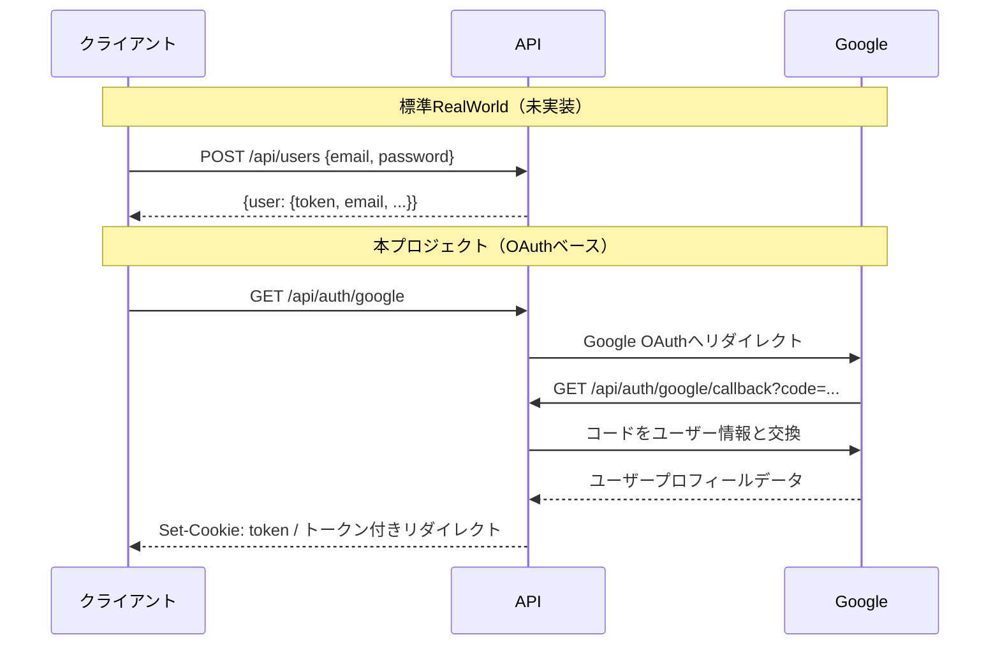
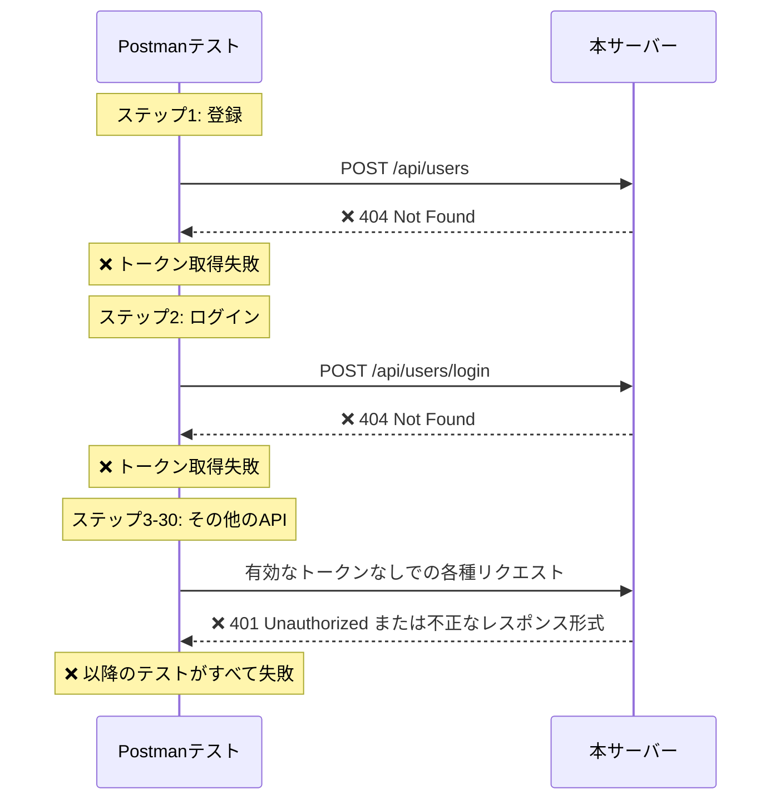

# API比較: 標準RealWorld vs 本プロジェクト

このドキュメントは、標準的な[RealWorld API仕様](https://realworld-docs.netlify.app/specifications/backend/endpoints/)と、本プロジェクトのOAuthベース実装の違いを説明します。

## 概要

本プロジェクトは、RealWorld API仕様の**ほとんど**を実装していますが、1つの重要な違いがあります：

- **標準RealWorld**: メール/パスワード認証を使用し、JWTトークンをJSONレスポンスで返す
- **本プロジェクト**: Google OAuth 2.0認証を使用し、トークンをCookie/ヘッダーで返す

このアーキテクチャの決定により2つのエンドポイントに影響がありますが、残りの18以上のエンドポイントとの互換性は維持されています。

## 認証フローの比較



## エンドポイント互換性テーブル

### ❌ 認証 - 非互換（2エンドポイント）

| エンドポイント     | 標準RealWorld           | 本プロジェクト  | 状態    |
| ------------------ | ----------------------- | --------------- | ------- |
| ユーザー登録       | `POST /api/users`       | **未実装**      | ❌ 無し |
| ログイン           | `POST /api/users/login` | **未実装**      | ❌ 無し |
| 現在のユーザー取得 | `GET /api/user`         | `GET /api/user` | ✅ 互換 |
| ユーザー更新       | `PUT /api/user`         | `PUT /api/user` | ✅ 互換 |

**本プロジェクトの代替エンドポイント:**

- `GET /api/auth/google` - Google OAuth フローの開始
- `GET /api/auth/google/callback` - OAuth コールバックハンドラー
- `POST /api/auth/register` - 保留中の登録を完了
- `GET /api/auth/user` - 認証済みユーザー情報の取得

### ✅ 記事 - 完全互換（9エンドポイント）

| エンドポイント | 標準RealWorld                         | 本プロジェクト                        | 状態    |
| -------------- | ------------------------------------- | ------------------------------------- | ------- |
| 記事一覧       | `GET /api/articles`                   | `GET /api/articles`                   | ✅ 互換 |
| フィード       | `GET /api/articles/feed`              | `GET /api/articles/feed`              | ✅ 互換 |
| 記事取得       | `GET /api/articles/:slug`             | `GET /api/articles/:slug`             | ✅ 互換 |
| 記事作成       | `POST /api/articles`                  | `POST /api/articles`                  | ✅ 互換 |
| 記事更新       | `PUT /api/articles/:slug`             | `PUT /api/articles/:slug`             | ✅ 互換 |
| 記事削除       | `DELETE /api/articles/:slug`          | `DELETE /api/articles/:slug`          | ✅ 互換 |
| お気に入り追加 | `POST /api/articles/:slug/favorite`   | `POST /api/articles/:slug/favorite`   | ✅ 互換 |
| お気に入り解除 | `DELETE /api/articles/:slug/favorite` | `DELETE /api/articles/:slug/favorite` | ✅ 互換 |

**カスタムエンドポイント:**

- `GET /api/articles/:slug/edit` - 編集用記事取得（認証チェック付き）

### ✅ コメント - 完全互換（3エンドポイント）

| エンドポイント | 標準RealWorld                             | 本プロジェクト                            | 状態    |
| -------------- | ----------------------------------------- | ----------------------------------------- | ------- |
| コメント取得   | `GET /api/articles/:slug/comments`        | `GET /api/articles/:slug/comments`        | ✅ 互換 |
| コメント追加   | `POST /api/articles/:slug/comments`       | `POST /api/articles/:slug/comments`       | ✅ 互換 |
| コメント削除   | `DELETE /api/articles/:slug/comments/:id` | `DELETE /api/articles/:slug/comments/:id` | ✅ 互換 |

### ✅ プロフィール - 完全互換（3エンドポイント）

| エンドポイント   | 標準RealWorld                           | 本プロジェクト                          | 状態    |
| ---------------- | --------------------------------------- | --------------------------------------- | ------- |
| プロフィール取得 | `GET /api/profiles/:username`           | `GET /api/profiles/:username`           | ✅ 互換 |
| フォロー         | `POST /api/profiles/:username/follow`   | `POST /api/profiles/:username/follow`   | ✅ 互換 |
| アンフォロー     | `DELETE /api/profiles/:username/follow` | `DELETE /api/profiles/:username/follow` | ✅ 互換 |

### ✅ タグ - 完全互換（1エンドポイント）

| エンドポイント | 標準RealWorld   | 本プロジェクト  | 状態    |
| -------------- | --------------- | --------------- | ------- |
| タグ取得       | `GET /api/tags` | `GET /api/tags` | ✅ 互換 |

### 🆕 カスタムエンドポイント

本プロジェクトには、標準RealWorld仕様にない追加エンドポイントが含まれています：

- `GET /api/sitemap` - 動的サイトマップデータの生成
- `GET /api/sitemap.xml` - XMLサイトマップの生成

## 統計

```
✅ 互換:      18エンドポイント（記事、コメント、プロフィール、タグ、ユーザー管理）
❌ 非互換:     2エンドポイント（POST /api/users、POST /api/users/login）
🆕 カスタム:   6エンドポイント（OAuthフロー + サイトマップ）
```

**互換性率: 90%**（標準エンドポイント20個中18個）

## 公式RealWorldテストが失敗する理由

公式の[RealWorld Postmanテストスイート](https://github.com/gothinkster/realworld/tree/main/api)を実行すると、次のような結果が表示されます：

```
requests:    32 executed, 0 failed   ✅ サーバーは応答している
assertions: 141 executed, 140 failed ❌ レスポンス形式/内容が異なる
```

### なぜこうなるのか

Postmanテストは**順次実行**され、認証に依存しています：



### これが意味すること

- ✅ **サーバーは正常に動作している** - 32個のHTTPリクエストすべてが成功
- ❌ **レスポンス構造が異なる** - OAuth認証とメール/パスワード認証の違いによる
- ⚠️ **バグではない** - これは意図的なアーキテクチャの違い

### 本プロジェクトのテスト方法

公式のPostmanスイートの代わりに、以下を使用してください：

```bash
# ユニット・統合テスト
pnpm test

# E2Eテスト（OAuth用に設定されている場合）
pnpm test:e2e
```

## 設計上の決定: なぜOAuthなのか？

本プロジェクトがメール/パスワード認証ではなくGoogle OAuthを選択した理由：

1. **セキュリティ**: パスワードの保存/ハッシュ化の懸念がない
2. **ユーザー体験**: 既存のGoogleアカウントでシングルサインオン
3. **モダンなアーキテクチャ**: 実世界のOAuth 2.0実装を実証
4. **プロダクション対応**: 業界標準の認証プロバイダーを使用

## 貢献者の方へ

このプロジェクトで作業する場合：

- ✅ ほとんどのRealWorld APIパターンは依然として適用されます
- ✅ 記事、コメント、プロフィール、タグ機能は完全に互換性があります
- ⚠️ 認証にはメール/パスワードではなくOAuthフローが必要です
- 📚 標準RealWorld実装と比較する際は、このドキュメントを参照してください

## 関連ドキュメント

- [RealWorld API仕様](https://realworld-docs.netlify.app/specifications/backend/endpoints/)
- [Google OAuth 2.0ドキュメント](https://developers.google.com/identity/protocols/oauth2)
- [OpenAPI仕様](./openapi.yml) - 生成されたAPIドキュメント
